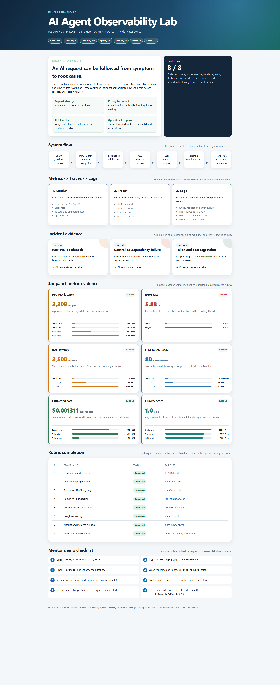
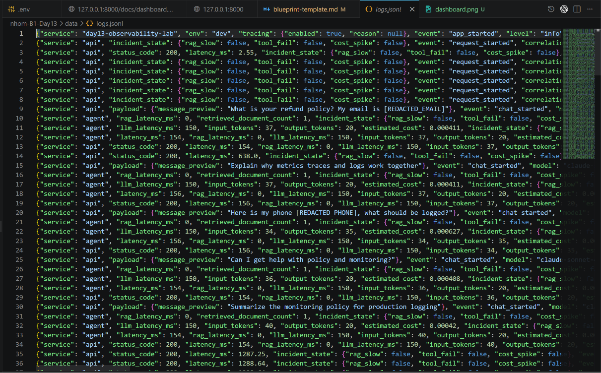
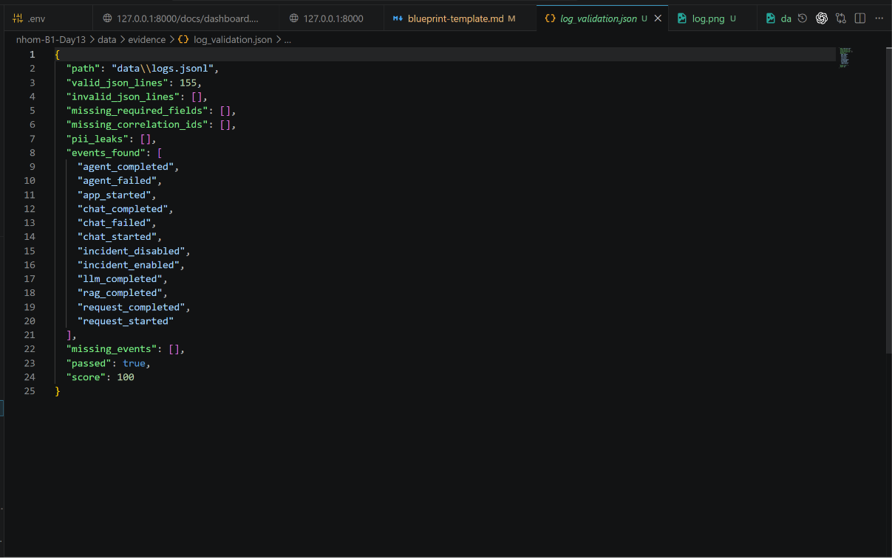
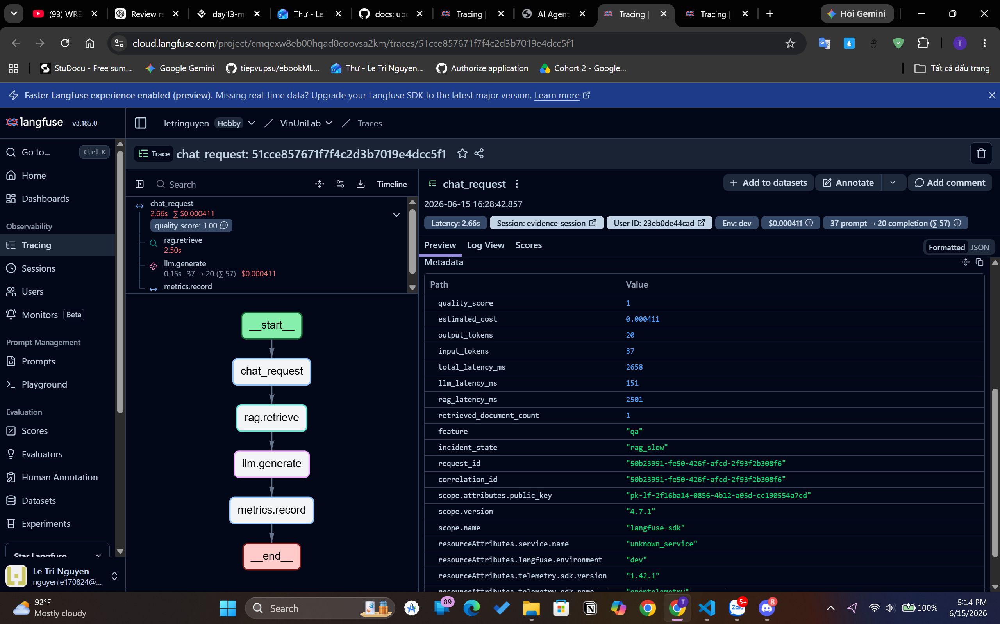
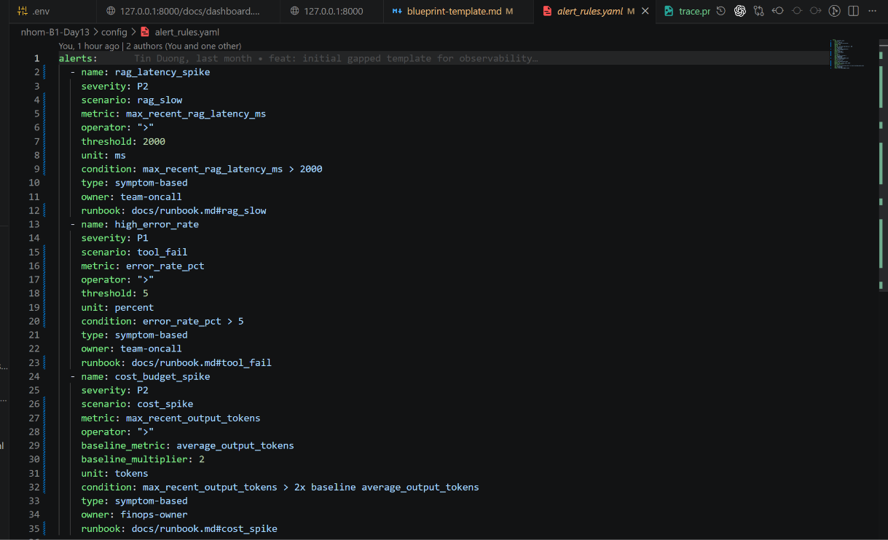

# Day 13 Observability Lab - Individual Report

> **Submission type**: Individual project. Machine-readable grading tags are
> preserved for compatibility with the original template.

## 1. Individual Metadata

- [GROUP_NAME]: Individual submission - Le Tri Nguyen
- [REPO_URL]: https://github.com/letringuyenn/nhom-B1-Day13
- [MEMBERS]:
  - Le Tri Nguyen | Role: Sole developer and report author
- Project type: FastAPI backend, simulated AI Agent/RAG, observability lab
- Primary endpoint: `POST /chat`

## 2. Verified Performance

- [VALIDATE_LOGS_FINAL_SCORE]: 100/100
- [TOTAL_TRACES_COUNT]: 10 verified traces in `data/evidence/trace_ids.md`
- [PII_LEAKS_FOUND]: 0
- Unit tests: 15/15 passed
- Keyword quality evaluation: 1.0
- Load test: 10/10 successful requests with 10 unique request IDs
- Alert validation: 3/3 incident rules firing
- Rubric completion: 8/8

## 3. Architecture

```text
Client
  -> POST /chat
  -> CorrelationIdMiddleware
  -> bind user/session/feature context
  -> LabAgent.run()
     -> rag.retrieve
     -> llm.generate
     -> metrics.record
  -> JSONL logs + Langfuse trace + in-memory metrics
  -> ChatResponse
```

The RAG and LLM are deterministic local simulations. This keeps the assignment
reproducible while preserving production-style observability boundaries.
Langfuse is the only optional external service.

## 4. Observability Design

Every request uses one shared identifier:

1. Reuse incoming `x-request-id`.
2. Otherwise reuse `X-Correlation-ID`.
3. Otherwise generate a UUID.
4. Return the value in both response headers.
5. Attach it to logs, metric request records, and Langfuse trace metadata.

The investigation workflow is:

```text
Metrics -> Traces -> Logs
```

Trace structure:

```text
chat_request
  rag.retrieve       (RETRIEVER)
  llm.generate       (GENERATION)
  metrics.record     (SPAN)
```

Raw function arguments are not captured automatically. Only sanitized input
and output previews are attached. Missing credentials disable tracing without
breaking the API; SDK failures produce a `tracing_failed` warning.

## 5. Logging and PII Design

Logs are JSON Lines at `data/logs.jsonl`. Important events include request,
chat, RAG, LLM, agent, incident, and error lifecycle records.

The central scrubber recursively handles strings, dictionaries, lists, and
tuples. It redacts:

- email addresses
- phone numbers
- credit card numbers
- national ID and passport patterns
- raw fields named `user_id`

Only a SHA-256-derived `user_id_hash` is bound to logs and traces.

## 6. Metrics, SLO, and Dashboard

| SLI             |         Target |                 Current evidence |
| --------------- | -------------: | -------------------------------: |
| Request P95     |      < 3000 ms |               Baseline 164.35 ms |
| Error rate      |           < 2% |   Baseline 0%; `tool_fail` 5.88% |
| Cost budget     | < USD 2.50/day |      Baseline total USD 0.006723 |
| Average quality |        >= 0.75 | Runtime 0.8357; keyword eval 1.0 |

Required metric panels:

1. Request latency P50/P95/P99
2. Error rate
3. RAG latency
4. LLM token usage
5. Estimated cost
6. Quality score

- [DASHBOARD_6_PANELS_SCREENSHOT]: docs/SCREENSHOT/dashboard_panels.png
- Interactive local report: `docs/dashboard.html`

![Observability report cover]



The dashboard is a self-contained local HTML report generated from evidence
JSON. This project does not claim a Prometheus or Grafana deployment.

## 7. Technical Evidence

### Correlation ID and Sanitized JSON Logs

- [EVIDENCE_CORRELATION_ID_SCREENSHOT]: docs/SCREENSHOT/log.png



The screenshot shows structured request/agent events and redacted values such
as `[REDACTED_EMAIL]` and `[REDACTED_PHONE]`. The complete lines in
`data/logs.jsonl` contain the shared correlation ID; the wide screenshot crops
some fields horizontally, so the JSONL file is the authoritative evidence.

### Log Validation and PII Check

- [EVIDENCE_PII_REDACTION_SCREENSHOT]: docs/SCREENSHOT/log_validation.png



The validator reports 155 valid JSON lines, zero invalid lines, zero missing
correlation IDs, zero PII leaks, all required events, and score 100.

### Langfuse Trace Waterfall

- [EVIDENCE_TRACE_WATERFALL_SCREENSHOT]: docs/SCREENSHOT/trace.png
- [TRACE_WATERFALL_EXPLANATION]: The captured `rag_slow` trace lasts about
  2.66 seconds. `rag.retrieve` consumes 2.50 seconds while `llm.generate`
  remains about 0.15 seconds, proving retrieval is the bottleneck.



### Alert Rules

- [ALERT_RULES_SCREENSHOT]: docs/SCREENSHOT/alert_rules.png
- [SAMPLE_RUNBOOK_LINK]: docs/runbook.md



The alert engine is `scripts/check_alerts.py`; its output is stored in
`data/evidence/alert_validation.json`.

## 8. Incident Analysis

### rag_slow

- [SCENARIO_NAME]: rag_slow
- [SYMPTOMS_OBSERVED]: The captured request reached 2658 ms total latency,
  including 2500 ms in RAG and 151 ms in LLM.
- [ROOT_CAUSE_PROVED_BY]: `data/evidence/rag_slow_metrics.json`, correlation ID
  `23580492-d302-422b-9e36-e8db8280f3b0`, and the Langfuse waterfall screenshot.
- [FIX_ACTION]: Disable the incident and apply a retrieval timeout or fallback.
- [PREVENTIVE_MEASURE]: Alert on RAG latency independently and enforce
  dependency timeout budgets.

### tool_fail

- Symptom: HTTP 500 with `RuntimeError`; captured error rate 5.88%.
- Correlation ID: `eadf1828-f93c-4538-92c4-9bc2d54abee7`.
- Trace behavior: `rag.retrieve` is marked as failed; later LLM work is absent.
- Root cause: simulated vector store timeout.
- Mitigation: disable the failing dependency and apply bounded retry/fallback.
- Evidence: `data/evidence/tool_fail_metrics.json`.

### cost_spike

- Symptom: output tokens increase from the normal range to 80.
- Per-request estimated cost: USD 0.001311.
- Correlation ID: `71e3b557-de0c-4028-9d00-b20bd3f85f92`.
- Root cause: the incident multiplies reported output token usage by four.
- Mitigation: cap output tokens and alert on token/cost baseline deviation.
- Evidence: `data/evidence/cost_spike_metrics.json`.

## 9. Alert Rules

| Alert               | Scenario     | Trigger                          | Result |
| ------------------- | ------------ | -------------------------------- | ------ |
| `rag_latency_spike` | `rag_slow`   | max recent RAG latency > 2000 ms | FIRING |
| `high_error_rate`   | `tool_fail`  | error rate > 5%                  | FIRING |
| `cost_budget_spike` | `cost_spike` | max output tokens > 2x baseline  | FIRING |

Rules: `config/alert_rules.yaml`

Validation: `data/evidence/alert_validation.json`

Operational response: `docs/runbook.md`

## 10. Individual Contribution and Evidence

### [MEMBER_A_NAME]: Le Tri Nguyen

- [TASKS_COMPLETED]: Implemented and verified the complete assignment:
  correlation middleware, structured logging, recursive PII redaction,
  Langfuse tracing, RAG/LLM spans, metrics, incidents, quality evaluation,
  alert validation, dashboard/report generation, tests, evidence, and docs.
- [EVIDENCE_LINK]: https://github.com/letringuyenn/nhom-B1-Day13

As this is an individual project, there are no additional team-member
contribution sections.

## 11. Submission Evidence

```text
data/logs.jsonl
data/evidence/baseline_metrics.json
data/evidence/rag_slow_metrics.json
data/evidence/tool_fail_metrics.json
data/evidence/cost_spike_metrics.json
data/evidence/quality_eval.json
data/evidence/log_validation.json
data/evidence/alert_validation.json
data/evidence/trace_ids.md
docs/dashboard.html
docs/SCREENSHOT/dashboard.png
docs/SCREENSHOT/dashboard_panels.png
docs/SCREENSHOT/log.png
docs/SCREENSHOT/log_validation.png
docs/SCREENSHOT/trace.png
docs/SCREENSHOT/alert_rules.png
```

## 12. Lessons Learned

- Service-level latency alone cannot distinguish RAG from LLM bottlenecks.
- A request ID makes metrics, traces, and logs one investigation instead of
  three disconnected tools.
- Redaction must be centralized and recursive because payload shapes change.
- Reliability, cost, and quality should be monitored together.
- Telemetry failure must be visible but must not become an application outage.
- Snapshot dashboards and local alert validation are suitable for this lab,
  but production systems need durable metrics and managed alert delivery.

## 13. Limitations

- Metrics are in memory and reset when the process restarts.
- The HTML dashboard is a generated report, not a real-time Grafana dashboard.
- Alert validation is local and does not send notifications.
- Langfuse requires valid credentials and network connectivity.
- The fake LLM and keyword evaluator do not model real production quality or
  billing behavior.

## 14. Bonus Items

- [BONUS_COST_OPTIMIZATION]: Token/cost baseline and cost-spike comparison are
  recorded in evidence JSON and the dashboard.
- [BONUS_AUDIT_LOGS]: Not implemented.
- [BONUS_CUSTOM_METRIC]: Separate RAG/LLM latency and quality pass rate.
